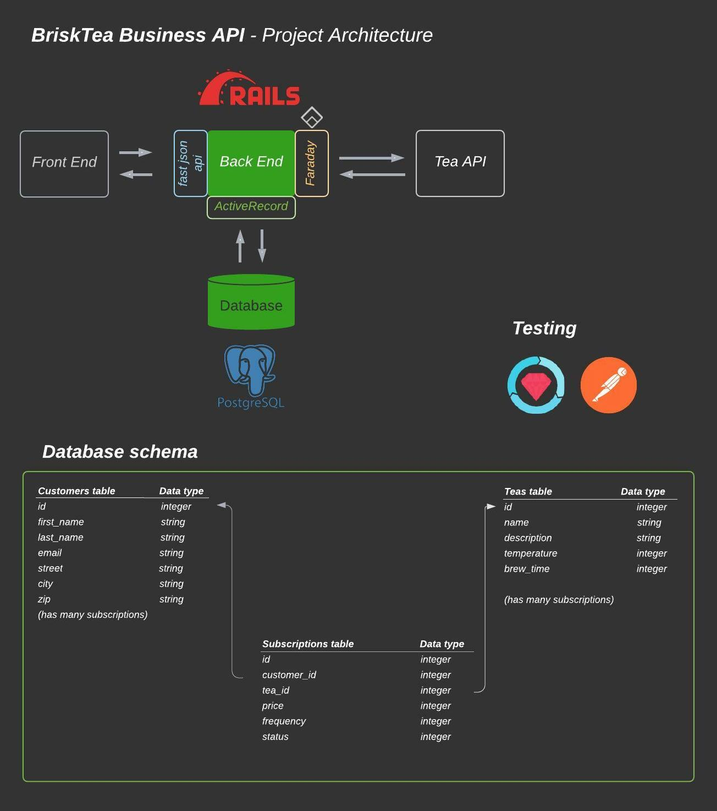

# _BriskTea Business_

## About
BriskTea Business is a RESTful back-end API which exposes Tea Subscription data.


## Table of contents
<!-- [**Getting Started**](#getting-started) | -->
[**Versions**](#versions) |
[**Project Design**](#project-design) |
[**Setup**](#setup) |
[**Endpoints**](#endpoints) |
[**Tests**](#running-the-tests) |
[**Developer**](#developer) |
<!-- [**Deployment**](#deployment) | -->

<!-- ## Getting Started
Visit us on [Heroku](https://???.herokuapp.com/) or on [Local Host 3000](http://localhost:3000/) to get started with the steps below. -->

## Versions
* Ruby 2.5.3
* Rails 5.2.5


## Project Design



## Setup
If you are running this API locally, follow the steps below:
  1. Fork and clone this repo
  2. Install gem packages by running `bundle`
  3. Setup the database: `rails db:(drop,create,migrate,seed)` or `rails db:setup`
  4. Run command `rails s` and navigate to http://localhost:3000 to consume API endpoints below

<!-- If you are running the API via [Heroku](https://???.herokuapp.com/), simply consume endpoints below. -->

## Endpoints
The following are all API endpoints. Note, some endpoints have optional or required query parameters.

~ All endpoints run off base connector http://localhost:3000 ~ 


| Method   | URI                                      | Description                              |
| -------- | ---------------------------------------- | ---------------------------------------- |
| `GET`    | `/api/v1/customers/:customer_id/subscriptions`     | Retrieve all subscriptions for a single customer.  |
| `POST`   | `/api/v1/customers/:customer_id/subscriptions`         | Create a new subscription for a customer.          |
| `PATCH`  | `/api/v1/customer_subscriptions/:id`     | Update a subscription status to 'cancelled'.  |


#### Endpoint to subscribe a customer to a tea subscription:
POST `http://localhost:3000/api/v1/customers/:customer_id/subscriptions`, 

body:
```
json 
{
  "customer_id": "1",
  "subscription_id": "1"
}
```

response: 
```
{
    "data": {
        "id": "1",
        "type": "customer_subscription",
        "attributes": {
            "id": "1",
            "customer_id": "1",
            "subscription_id": "1",
            "status": "active"
        }
    }
}
```


#### Endpoint to cancel a customer’s tea subscription:
PATCH/PUT `http://localhost:3000/api/v1/customers/:customer_id/subscriptions/:id`

body:
```
json 
{
  "customer_id": "1",
  "subscription_id": "2"
}
```

response: 
```
{
    "data": {
        "id": "2",
        "type": "customer_subscription",
        "attributes": {
            "customer_id": "1",
            "subscription_id": "2",
            "status": "cancelled"
        }
    }
}
```


#### Endpoint to see all of a customer’s subsciptions (active and cancelled):
GET `http://localhost:3000/api/v1/customers/:customer_id/subscriptions`

response: 
```
{
    "data": ["data": {
        "id": "1",
        "type": "subscription",
        "attributes": {
            "id": "1",
            "title": "Cassidy Gongmei Tea Box"
            "price": "6400"
            "status": "active"
            "frequency": "6"
        }, 
        "id": "2",
        "type": "subscription",
        "attributes": {
            "id": "2",
            "title": "Ripple Valerian Tea Box"
            "price": "3700"
            "status": "cancelled"
            "frequency": "6"
        } 
    }]
}
```


## Running the Tests

Run all tests in application with `bundle exec rspec`. When test is complete, run `open coverage` to see where tests are being run and where they are not.


<!-- ## Deployment

- To run this app locally, run `rails s` and navigate to `http://localhost:3000/` in your browser.
- To run this app on Heroku, go to https://downdraft-backend.herokuapp.com/ -->


## Developer
### Joe Mecha  [GitHub](https://github.com/joemecha) • [LinkedIn](https://www.linkedin.com/in/joemecha/)
