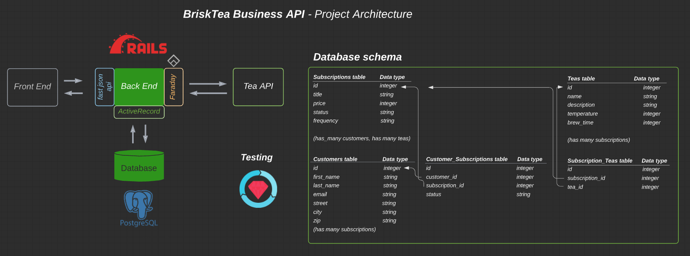

# _BriskTea Business_

## About
BriskTea Business is a RESTful back-end API which exposes Tea Subscription data.

## Table of contents
<!-- [**Getting Started**](#getting-started) | -->
[**Versions**](#versions) |
[**Project Design**](#project-design) |
[**Setup**](#setup) |
[**Endpoints**](#endpoints) |
[**Examples**](#examples) |
[**Tests**](#running-the-tests) |
[**Developer**](#developer) |
<!-- [**Deployment**](#deployment) | -->

<!-- ## Getting Started
Visit us on [Heroku](https://???.herokuapp.com/) or on [Local Host 3000](http://localhost:3000/) to get started with the steps below. -->

## Versions
* Ruby 2.5.3
* Rails 5.2.5


## Project Design



## Setup
If you are running this API locally, follow the steps below:
  1. Fork and clone this repo
  2. Install gem packages by running `bundle`
  3. Setup the database: `rails db:(drop,create,migrate,seed)` or `rails db:setup`
  4. Run command `rails s` and navigate to http://localhost:3000 to consume API endpoints below

<!-- If you are running the API via [Heroku](https://???.herokuapp.com/), simply consume endpoints below. -->

## Endpoints
The following are all API endpoints. Note, some endpoints have optional or required query parameters.
- All endpoints run off base connector http://localhost:3000 on local 
<!-- or https://???.herokuapp.com/ on Heroku -->


### Endpoint to subscribe a customer to a tea subscription:

| Method   | URL                                      | Description                              |
| -------- | ---------------------------------------- | ---------------------------------------- |
| `POST`   | `/api/v1/customer_subscriptions`         | Create a customer subscription.          |
__required parameters:__ customer id, subscription id


### Endpoint to cancel a customer’s tea subscription:

| Method   | URL                                      | Description                              |
| -------- | ---------------------------------------- | ---------------------------------------- |
| `PATCH`  | `/api/v1/customer_subscriptions/:id`     | Customer subscription to status 'cancelled'.  |
__required parameters:__ customer_subscription id, customer id, subscription id


### Endpoint to see all of a customer’s subsciptions (active and cancelled):

| Method   | URL                                      | Description                              |
| -------- | ---------------------------------------- | ---------------------------------------- |
| `GET`    | `/api/v1/customer_subscriptions/:id`     | Retrieve all subscriptions for a single customer.              |
__required parameters:__ customer id, as ':id'


## Examples

### A new customer subscription:

```
{
    "data": {
        "id": "12",
        "type": "customer_subscription",
        "attributes": {
            "customer_id": 1,
            "subscription_id": 2,
            "status": "active"
        }
    }
}
```

### All subscriptions for a customer:

```
{
    "data": [
        {
            "id": "1",
            "type": "subscription",
            "attributes": {
                "title": "Dark Star Cerasse Tea Box",
                "price": 6300,
                "status": "active",
                "frequency": 12
            },
            "relationships": {
                "teas": {
                    "data": [
                        {
                            "id": "1",
                            "type": "tea"
                        }
                    ]
                }
            }
        },
        {
            "id": "6",
            "type": "subscription",
            "attributes": {
                "title": "Jack Straw Yi Zhen Bai Hao Tea Box",
                "price": 6900,
                "status": "active",
                "frequency": 12
            },
            "relationships": {
                "teas": {
                    "data": [
                        {
                            "id": "6",
                            "type": "tea"
                        }
                    ]
                }
            }
        }
    ]
}

```

## Running the Tests

Run all tests in application with `bundle exec rspec`. When test is complete, run `open coverage` to see where tests are being run and where they are not.


<!-- ## Deployment

- To run this app locally, run `rails s` and navigate to `http://localhost:3000/` in your browser.
- To run this app on Heroku, go to https://downdraft-backend.herokuapp.com/ -->


## Developer
* Joe Mecha [GitHub](https://github.com/joemecha) • [LinkedIn](https://www.linkedin.com/in/joemecha/)
